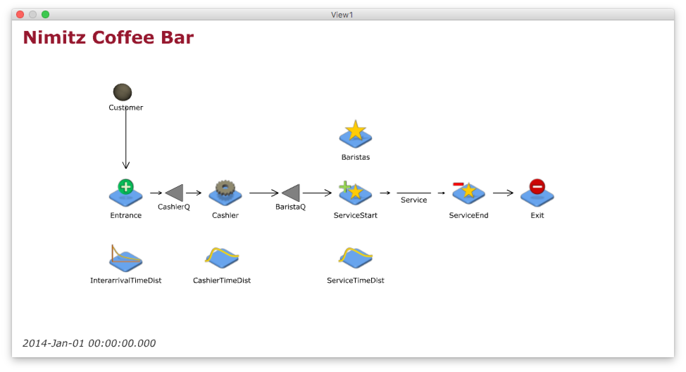

# Problem statement

In this study, we use simulation to analyze the Nimitz Coffee Bar (NCB) cafe, a popular coffee shop located within Nimitz library. NCB has a line where customers wait to place their order with the cashier. Once they have ordered, either a barista complete their order or they self serve their order at a coffee dispenser. Once their order is completed, the customer might add condiments such as cream or sugar to their drink. sOrder completion is conducted on a first-in, first-out (FIFO) basis.

The manager at NCB is trying to decide how many baristas to work and specifically would like to know the impact that the number of baristas has on the customer experience.
Therefore, we examine the effect of additional baristas on the average delay experienced
by customers after placing their orders. In particular, we measure the simulated average delay customers experience at the barista queue with 1, 2, 3, and 4 baristas. By understanding the impact on the barista queue delay, we focus on the part of NCB directly affected by the number of baristas working.

```{r setup, echo = FALSE, include = FALSE}
wdpath="/Users/david/Documents/Dropbox/teaching/sa421/sa421.f17/sa421-fall-2017/projects/nimitz-cafe/src"
setwd(wdpath)
library(readxl)
library(fitdistrplus)
library(dplyr)
library(knitr)
library(ggplot2)
```

# Input data analysis

## Interarrival times

```{r echo = FALSE}
# Read arrival times from Excel file
arrival.data <- read_excel('cafe-data.xlsx', 
                           range = 'Sheet1!A2:A88', 
                           col_names = 'arrival.time')

# Sort arrival times 
# Compute interarrival times in seconds, convert to numeric 
# Assume that simultaneous arrivals are in fact 1 second apart
# Remove NA data
arrival.data <- arrival.data %>%
  arrange(arrival.time) %>%
  mutate(interarrival.time = as.numeric(arrival.time - lag(arrival.time))) %>% 
  mutate(interarrival.time = if_else(interarrival.time <= 0, 1, interarrival.time)) %>%
  filter(!is.na(interarrival.time))
```

First, we consider the arrival data. To simplify matters, we assumed that any simultaneous arrivals are in fact one second apart.

```{r echo = FALSE, include = FALSE}
# Inspect data 
# This plot is just for investigative purposes, and will be hidden in the final report
# To see this plot, set include to TRUE above and re-run this chunk
plotdist(arrival.data$interarrival.time)
```

```{r echo = FALSE, include = FALSE}
# Find maximum likelihood estimator for exponential, gamma, and lognormal distributions
interarrival.fit.exp <- fitdist(arrival.data$interarrival.time, "exp")
summary(interarrival.fit.exp)

interarrival.fit.gamma <- fitdist(arrival.data$interarrival.time, "gamma")
summary(interarrival.fit.gamma)

interarrival.fit.lnorm <- fitdist(arrival.data$interarrival.time, "lnorm")
summary(interarrival.fit.lnorm)
```

After inspecting the data visually, we determined that the interarrival times may be appropriately modeled by an exponential, gamma, or lognormal distribution. Using maximum likelihood estimation, the interarrival times best fit

* an exponential distribution with rate `r interarrival.fit.exp$estimate[["rate"]]`, 
* a gamma distribution with shape `r interarrival.fit.gamma$estimate[["shape"]]` and rate `r interarrival.fit.gamma$estimate[["rate"]]`, and
* a lognormal distribution with mean `r interarrival.fit.lnorm$estimate[["meanlog"]]` and standard deviation `r interarrival.fit.lnorm$estimate[["sdlog"]]`.

The histogram of the interarrival time data and the probability density functions of the fitted distributions are shown below.

```{r echo = FALSE}
# Plot histogram and theoretical densities
denscomp(list(interarrival.fit.exp, 
              interarrival.fit.gamma, 
              interarrival.fit.lnorm), 
         legendtext = c('exponential', 'gamma', 'lognormal'), 
         plotstyle = 'ggplot')
```

The empirical cumulative distribution function of the interarrival time data and the theoretical cumulative distribution functions of the fitted distributions are shown below. 

```{r echo = FALSE}
# Plot empirical and theoretical cdfs
cdfcomp(list(interarrival.fit.exp, 
             interarrival.fit.gamma, 
             interarrival.fit.lnorm), 
        legendtext = c('exponential', 'gamma', 'lognormal'), 
        plotstyle = 'ggplot')
```

In addition, the goodness-of-fit statistics for these fitted distributions are given in the tables below:

```{r echo = FALSE}
# Compute goodness-of-fit statistics
interarrival.gof <- gofstat(list(interarrival.fit.exp, 
                                 interarrival.fit.gamma, 
                                 interarrival.fit.lnorm), 
                            fitnames = c('exponential', 'gamma', 'lognormal'))
```

|                              | Exponential                             | Gamma                             | Lognormal                             |
| -----------------------------| --------------------------------------: | --------------------------------: |-------------------------------------: |
| Kolmogorov-Smirnov statistic | `r interarrival.gof$ks['exponential']`  | `r interarrival.gof$ks['gamma']`  | `r interarrival.gof$ks['lognormal']`  |
| AIC                          | `r interarrival.gof$aic['exponential']` | `r interarrival.gof$aic['gamma']` | `r interarrival.gof$aic['lognormal']` |
| BIC                          | `r interarrival.gof$bic['exponential']` | `r interarrival.gof$bic['gamma']` | `r interarrival.gof$bic['lognormal']` |

From the graphs above, we see that the exponential and gamma distributions appear to better fit the interarrival time data than the lognormal distribution. Furthermore, as we see in the table above, among the three distributions, the gamma distribution has the best AIC, BIC, and K-S statistic.  So, for our simulation study, we chose to model the interarrival times with the gamma distribution with shape `r interarrival.fit.gamma$estimate['shape']` and rate `r interarrival.fit.gamma$estimate['rate']`.

### Cashier times

```{r, echo=FALSE}
# Read service times from Excel file
cashier.data <- read_excel('cafe-data.xlsx', 
                           range = 'Sheet1!E2:E28', 
                           col_names = 'cashier.time')
```

```{r echo = FALSE, include = FALSE}
# Inspect data 
# This plot is just for investigative purposes, and will be hidden in the final report
# To see this plot, set include to TRUE above and re-run this chunk
plotdist(cashier.data$cashier.time)
```

Next, we consider the time each customer spends at the cashier.
After inspecting the data visually, we determined that the cashier times may be appropriately modeled by a gamma or lognormal distribution.

```{r echo = FALSE, include = FALSE}
# Find maximum likelihood estimator for gamma and lognormal distributions
cashier.fit.gamma <- fitdist(cashier.data$cashier.time, "gamma")
summary(cashier.fit.gamma)

cashier.fit.lnorm <- fitdist(cashier.data$cashier.time, "lnorm")
summary(cashier.fit.lnorm)
```

Using maximum likelihood estimation, the cashier times best fit

* a gamma distribution with shape `r cashier.fit.gamma$estimate['shape']` and rate `r cashier.fit.gamma$estimate['rate']`, and
* a lognormal distribution with mean `r cashier.fit.lnorm$estimate['meanlog']` and standard deviation `r cashier.fit.lnorm$estimate['sdlog']`.

The histogram of the cashier time data and the probability density functions of the fitted distributions are shown below.

```{r echo = FALSE}
# Plot histogram and theoretical densities
denscomp(list(cashier.fit.gamma, cashier.fit.lnorm), 
         legendtext = c('gamma', 'lognormal'), 
         plotstyle = 'ggplot')
```

The empirical cumulative distribution function of the cashier time data and the theoretical cumulative distribution functions of the fitted distributions are shown below. 

```{r echo = FALSE}
# Plot empirical and theoretical cdfs
cdfcomp(list(cashier.fit.gamma, cashier.fit.lnorm), 
        legendtext = c('gamma', 'lognormal'), 
        plotstyle = 'ggplot')
```

In addition, the goodness-of-fit statistics for these fitted distributions are given in the tables below:

```{r echo = FALSE, include = FALSE}
# Compute goodness-of-fit statistics 
cashier.gof <- gofstat(list(cashier.fit.gamma, cashier.fit.lnorm), 
                       fitnames = c('gamma', 'lognormal'))
```

|                              | Gamma                        | Lognormal                        |
| -----------------------------| ---------------------------: |--------------------------------: |
| Kolmogorov-Smirnov statistic | `r cashier.gof$ks['gamma']`  | `r cashier.gof$ks['lognormal']`  |
| AIC                          | `r cashier.gof$aic['gamma']` | `r cashier.gof$aic['lognormal']` |
| BIC                          | `r cashier.gof$bic['gamma']` | `r cashier.gof$bic['lognormal']` |

From the graphs above, we see that both the gamma and lognormal distributions appear to be reasonable choices. Furthermore, as we see in the table above, between the two distributions, the lognormal distribution has the better AIC, BIC, and K-S statistic.  So, for our simulation study, we chose to model the interarrival times with the lognormal distribution with mean `r cashier.fit.lnorm$estimate['meanlog']` and standard deviation `r cashier.fit.lnorm$estimate['sdlog']`.

### Service times

```{r, echo=FALSE}
# Read service times from Excel file
service.data <- read_excel('cafe-data.xlsx', range = 'Sheet1!C2:C39', col_names = 'service.time')
```

```{r echo = FALSE, include = FALSE}
# Inspect data 
# This plot is just for investigative purposes, and will be hidden in the final report
# To see this plot, set include to TRUE above and re-run this chunk
plotdist(service.data$service.time)
```

Finally, we analyze the time it takes the baristas to serve each customer.
After inspecting the data visually, we determined that the service times may be appropriately modeled by a gamma or lognormal distribution.

```{r echo = FALSE, include = FALSE}
# Find maximum likelihood estimator for gamma and lognormal distributions
service.fit.gamma <- fitdist(service.data$service.time, "gamma")
summary(service.fit.gamma)

service.fit.lnorm <- fitdist(service.data$service.time, "lnorm")
summary(service.fit.lnorm)
```

Using maximum likelihood estimation, the service times best fit

* a gamma distribution with shape `r service.fit.gamma$estimate[["shape"]]` and rate `r service.fit.gamma$estimate[["rate"]]`, and
* a lognormal distribution with mean `r service.fit.lnorm$estimate[["meanlog"]]` and standard deviation `r service.fit.lnorm$estimate[["sdlog"]]`.

The histogram of the service time data and the probability density functions of the fitted distributions are shown below.

```{r echo = FALSE}
# Plot histogram and theoretical densities 
denscomp(list(service.fit.gamma, service.fit.lnorm), 
         legendtext = c('gamma', 'lognormal'), 
         plotstyle = 'ggplot')
```

The empirical cumulative distribution function of the service time data and the theoretical cumulative distribution functions of the fitted distributions are shown below. 

```{r echo = FALSE}
# Plot empirical and theoretical cdfs
cdfcomp(list(service.fit.gamma, service.fit.lnorm), 
        legendtext = c('gamma', 'lognormal'), 
        plotstyle = 'ggplot')
```

In addition, the goodness-of-fit statistics for these fitted distributions are given in the tables below:

```{r echo = FALSE}
# Compute goodness-of-fit statistics
service.gof <- gofstat(list(service.fit.gamma, service.fit.lnorm), 
                       fitnames = c('gamma', 'lognormal'))
```

|                              | Gamma                        | Lognormal                        |
| -----------------------------| ---------------------------: |--------------------------------: |
| Kolmogorov-Smirnov statistic | `r service.gof$ks['gamma']`  | `r service.gof$ks['lognormal']`  |
| AIC                          | `r service.gof$aic['gamma']` | `r service.gof$aic['lognormal']` |
| BIC                          | `r service.gof$bic['gamma']` | `r service.gof$bic['lognormal']` |

Again, from the graphs above, we see that both the gamma and lognormal distributions appear to be reasonable choices. Furthermore, as we see in the table above, between the two distributions, the gamma distribution has the better AIC, BIC, and K-S statistic.  So, for our simulation study, we chose to model the interarrival times with the gamma distribution with shape `r service.fit.gamma$estimate['shape']` and rate `r service.fit.gamma$estimate['rate']`.

# Simulation model and scenarios

We modeled the NCB in JaamSim. A graphical representation of the simulation model is shown below.



We examined the average delay experienced by customers after placing their orders when NCB has 1, 2, 3, and 4 baristas working.  For each of these numbers of baristas, we ran our simulation 100 times. 

```{r echo = FALSE, include = FALSE}
# Run simulation
system('java -jar "/Applications/jaamsim/JaamSim2017-09.jar" "nimitz-cafe-simulation.cfg" -b')
```

# Simulation output analysis

```{r echo = FALSE, include = FALSE}
# Read output from simulation
output <- read.table("nimitz-cafe-simulation.dat",
                     sep="\t", skip=3, 
                     col.names=c('number.of.baristas', 'run', 'avg.delay','avg.stime'))
```

The table below shows our simulation's predictions of the mean average delay experienced by customers after placing their orders when there are 1, 2, 3, and 4 baristas in the cafe. The table also includes the corresponding 95% confidence interval lengths. As we see in the table, the predicted mean average delay decreases by at least an order of magnitude with each additional barista. Similarly, the lengths of the 95% confidence intervals suggest that the predicted mean average delay increases in reliability by an order of magnitude for each additional barista.

```{r echo = FALSE }
# Summarize output data
output %>%
  group_by(number.of.baristas) %>%
  summarise(mean.avg.delay = mean(avg.delay), ci.range = 2*1.96*sd(avg.delay)/sqrt(n())) %>%
  kable(col.names = c('Number of baristas', 'Predicted mean average delay (seconds)', '95% CI length'))
```

# Conclusion

Based on our simulation, we suggest that NCB has at least two baristas working. We suggest NCB consider further information and study to determine between 2, 3, or 4 baristas. Increasing the number of baristas from 1 to 2 had the largest effect, reducing the simulated average delay from around 2 minutes to 10 seconds, i.e., by a factor of approximately 12 times. Increasing the number of baristas from 2 to 3 and 3 to 4 also decreases the predicted delay but by smaller amounts, from approximately 10 seconds to x seconds and from approximately x seconds to y seconds. The reliability of these predictions imply these estimates have a worst case variability of 27% of the predicted mean. 

We suggest NCB pursue the following to determine between 2, 3, or 4 baristas:

  -Increase the number of simulation samples to improve the prediction reliability.
  -Consider other performance measures based on further NCB objectives, e.g., sojourn time would provide more insight into the overall customer experience.
  -Consider a cost and revenue analysis of having 2, 3, or 4 baristas.

